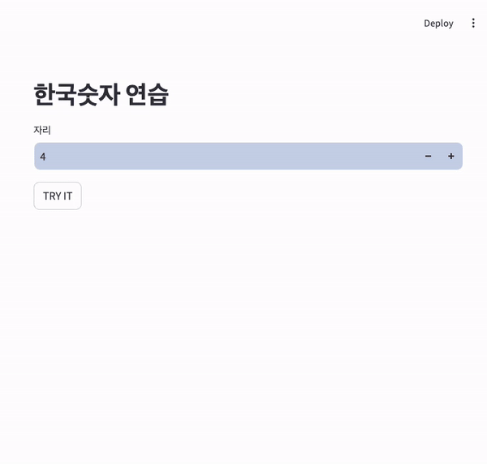

# Korean Number Pronunciation Practicing

This app randomly generates a number and provides an audio pronunciation for it. The Answer button displays the Korean representation of the number.



# Features

- Randomly generates Korean numbers and their audio pronunciation with each click.
- Allows users to specify the number of digits they want to practice.


# Installation

1. Clone this repository: 

    ```sh 
    git clone https://github.com/phlin0424//koearn_num.git
    ```

2. Launch the app using Docker containers:

    ```sh
    docker-compose up --build
    ```

3. Or, launch the app in a local mode using: 

    ```sh
    poetry install
    mkdir src/data
    sh start.sh
    ```
